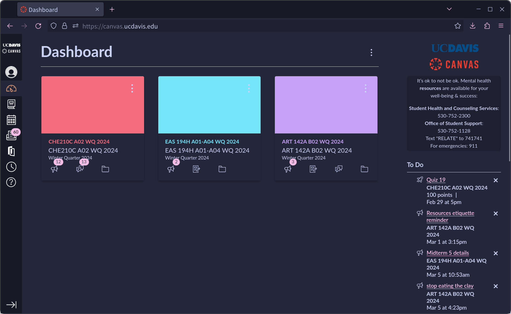

<h3 align="center">
     
    
    Catppuccin for <a href="https://canvas.ucdavis.edu/">UC Davis Canvas</a>
    
</h3>

## Preview

    
    <em>Macchiato theme with pink accent </em>

## Usage

1. Install the Stylus extension for <a href="https://chromewebstore.google.com/detail/stylus/clngdbkpkpeebahjckkjfobafhncgmne?pli=1">Chrome</a> or <a href= "https://addons.mozilla.org/en-US/firefox/addon/styl-us/"> Firefox </a>
2. Open <a href="https://github.com/PuffyDucks/davis-canvas-dark-mode/raw/main/catppuccin.user.css">catppuccin.user.css</a> in your browser, or install from <a href="https://userstyles.world/style/15195/catppuccin-for-uc-davis-canvas">UserStyles.World</a>
3. Choose a theme and accent color, then press install!

## More info
Latte is light mode, frappe is dark, macchiato is darker, and mocha is darkest. 

A few buttons or pages may have been missed, such as for quizzes. If you find any issues, feel free to let me know!😸 

    

    Copyright &copy; 2021-present <a href="https://github.com/catppuccin" target="_blank">Catppuccin Org</a>

    

